# ANUBIS

Anubis es un software construido completamente en python el cual te permite realizar un análisis estático de forma rápida a ejecutables de Windows. 

Instalacion de requerimientos:
```
sudo pip install -r REQUERIMENTS.txt
```

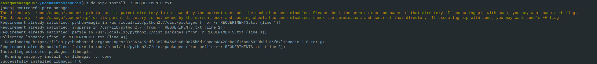

Menu inicial:
```
sudo python anubis.py
```

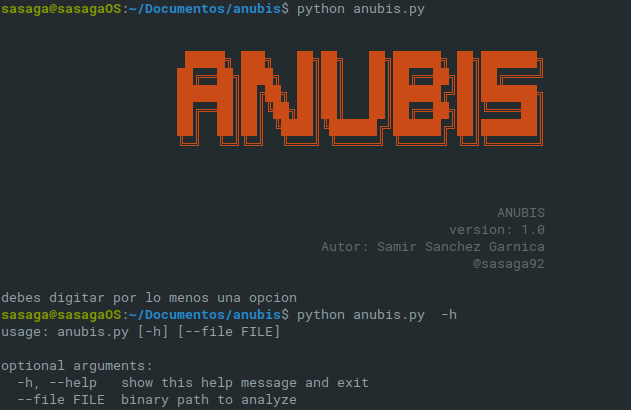

Ejecucion de anubis sobre ejecutable de windows:
```
sudo python anubis.py --file ../MUESTRAS/ransomware.exe
```

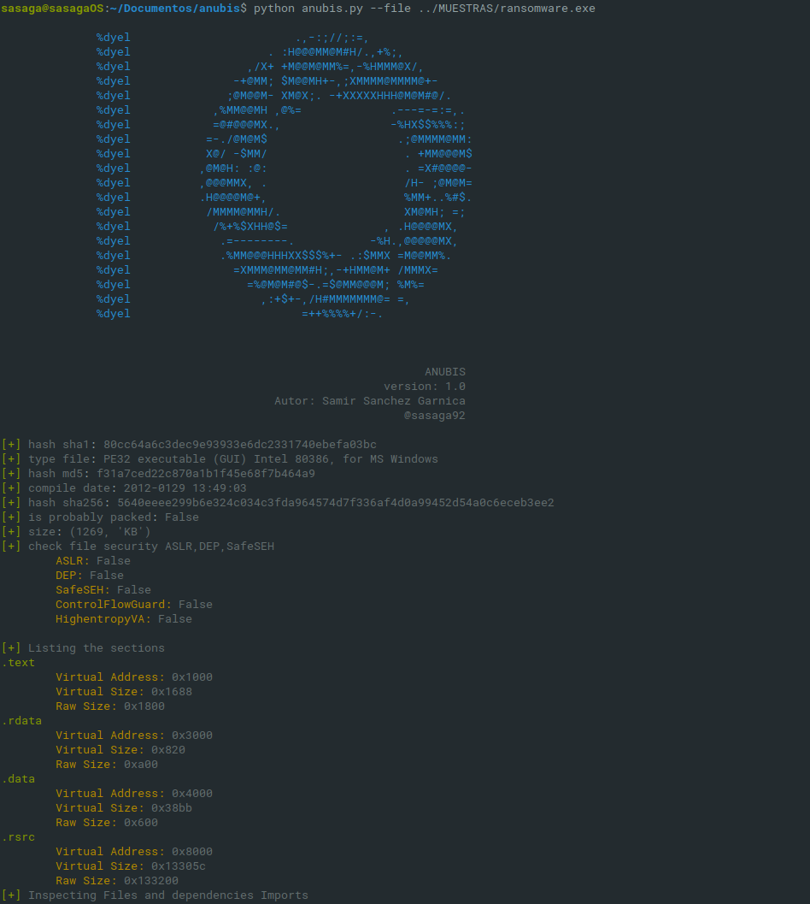
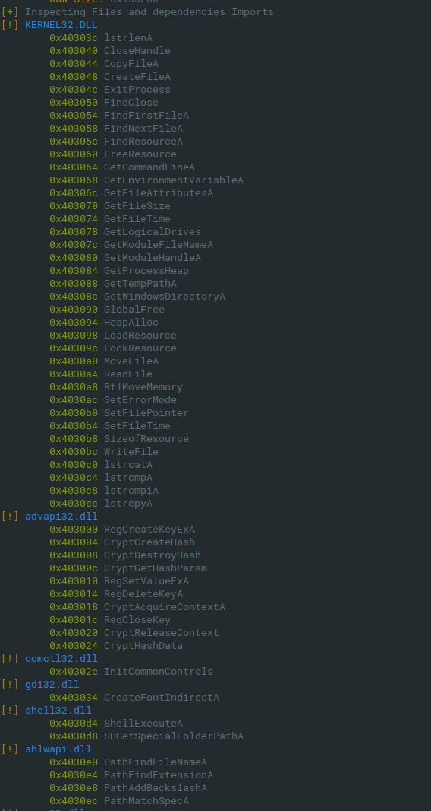
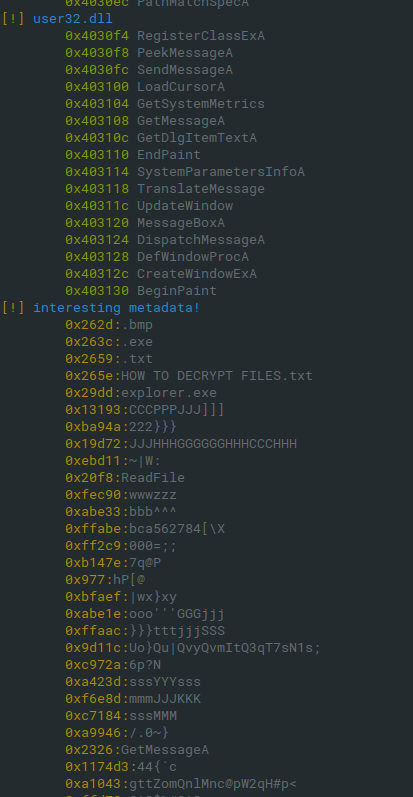

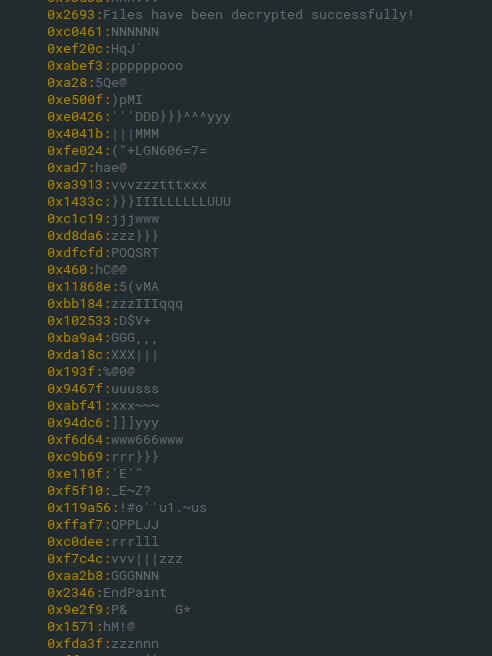
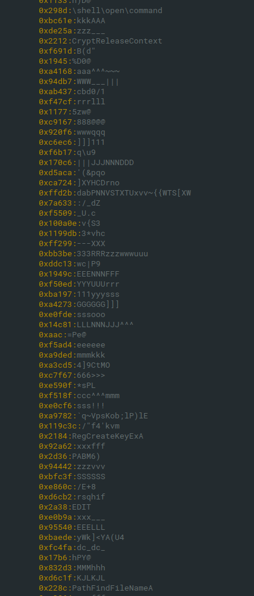
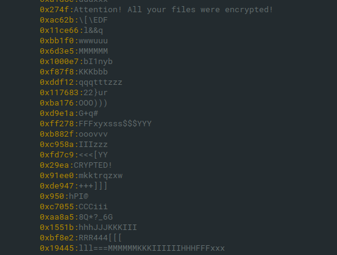
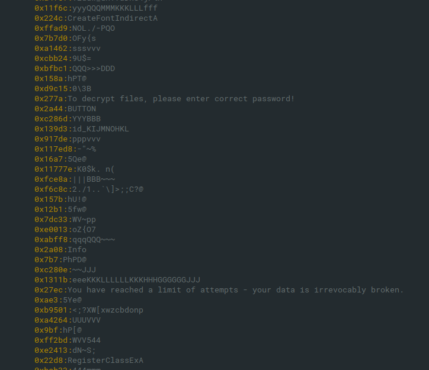
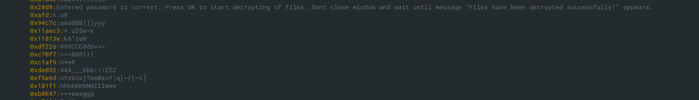
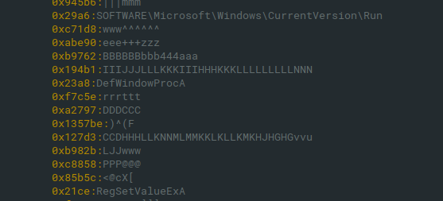

Puedes colaborar a que siga creando nuevas herramientas con una donación en [Paypal](https://www.paypal.me/exploitwriter) a paypal.me/exploitwriter
by [@sasaga92](https://twitter.com/sasaga92)


:heart_eyes: happy hacking!!!